# Simple RoomOS Web Widget

A lightweight, front-end-only information widget for Cisco RoomOS devices, hosted with GitHub Pages and configured entirely through URL hash parameters.

The widget uses a fixed 600 × 600 CSS-pixel canvas at normal RoomOS display sizes, keeping the same scale on 1080p and 4K screens. With no configured content, it points users to the settings gear and displays a QR code above the permanent footer with the message **Scan to learn more about the Simple WebWidget**.

## User Guide

The easiest way to configure the widget is the gear in the top-right. It opens a compact drawer that shifts the widget left, previews valid changes live, shows only the fields needed for each choice, and writes the applied configuration after the `#` in the GitHub Pages URL.

1. Open the gear and select only the sections you want to include.
2. Use the toggles for weather and time. Weather can request the device location, with manual coordinates available as a fallback. Time can follow the device automatically or use a selected IANA time zone.
3. For each information block, choose **Not included**, **Text**, **Website / iframe**, or **H2R countdown**.
4. Select **Apply configuration** to replace the current hash parameters. The widget updates in place without reloading the page. RoomOS theme colors wait one second, then transition smoothly to the new palette. Browsers and devices configured to reduce motion switch immediately. Optionally enable **Hide the settings gear after applying** for deployment.

<table>
  <tr>
    <td align="center">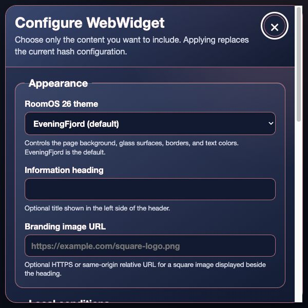<br><sub>The compact drawer shifts the widget left and previews valid changes live</sub></td>
    <td align="center">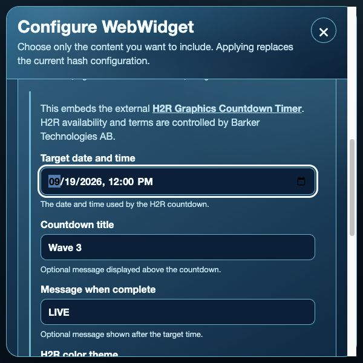<br><sub>H2R countdown mode reveals target, title, completion message, and color fields</sub></td>
  </tr>
</table>

Only the sections represented by applied parameters are shown.


| Area | Parameters | Effect |
| --- | --- | --- |
| Header, left | `iconUrl`, `heading` | Optional borderless branding icon and information heading |
| Header, right | `weather`, `latitude`, `longitude`, `temperatureUnit`, `time`, `timeZone` | Compact local weather and time area |
| First block | `info1` | First text or iframe information block |
| Second block | `info2` | Second text or iframe information block |
| Third block | `info3` | Third text or iframe information block |

<table>
  <tr>
    <td align="center">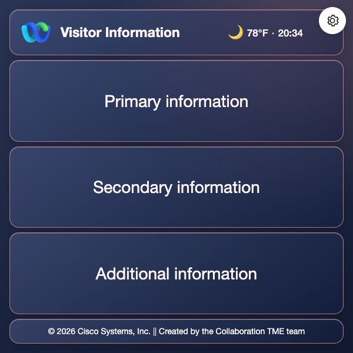<br><sub><code>iconUrl</code> shares the header; all three information blocks remain available</sub></td>
    <td align="center"><br><sub>No hash parameters: use the gear to configure or scan to learn more</sub></td>
  </tr>
</table>

The `theme` parameter controls the entire background, glass surfaces, borders, and text palette. The footer remains visible in every permutation.

The footer is not editable with hash parameters.

### Ready-to-use examples

Each example is a complete URL and can be opened directly or pasted into a RoomOS Web Widget configuration.

#### Unconfigured widget

[Open the unconfigured widget](https://ctg-tme.github.io/Simple-WebWidget/#xLaunch=SWW_Example)

```text
https://ctg-tme.github.io/Simple-WebWidget/#xLaunch=SWW_Example
```

#### Three information blocks

[Open the three-block example](https://ctg-tme.github.io/Simple-WebWidget/#theme=EveningFjord&heading=Visitor%20Information&weather=true&latitude=40.7128&longitude=-74.0060&temperatureUnit=fahrenheit&time=true&timeZone=America%2FNew_York&info1=Primary%20information&info2=Secondary%20information&info3=Additional%20information&xLaunch=SWW_Example)

```text
https://ctg-tme.github.io/Simple-WebWidget/#theme=EveningFjord&heading=Visitor%20Information&weather=true&latitude=40.7128&longitude=-74.0060&temperatureUnit=fahrenheit&time=true&timeZone=America%2FNew_York&info1=Primary%20information&info2=Secondary%20information&info3=Additional%20information&xLaunch=SWW_Example
```

#### Branding image with all three information blocks

[Open the branding example](https://ctg-tme.github.io/Simple-WebWidget/#theme=ChiliPlum&heading=Visitor%20Information&weather=true&latitude=40.7128&longitude=-74.0060&temperatureUnit=fahrenheit&time=true&timeZone=America%2FNew_York&info1=Primary%20information&info2=Secondary%20information&info3=Additional%20information&iconUrl=https%3A%2F%2Fgithub.com%2FWebexSamples.png%3Fsize%3D256&xLaunch=SWW_Example)

```text
https://ctg-tme.github.io/Simple-WebWidget/#theme=ChiliPlum&heading=Visitor%20Information&weather=true&latitude=40.7128&longitude=-74.0060&temperatureUnit=fahrenheit&time=true&timeZone=America%2FNew_York&info1=Primary%20information&info2=Secondary%20information&info3=Additional%20information&iconUrl=https%3A%2F%2Fgithub.com%2FWebexSamples.png%3Fsize%3D256&xLaunch=SWW_Example
```

#### Iframe information block

[Open the iframe example](https://ctg-tme.github.io/Simple-WebWidget/#theme=CrystalMist&heading=Embedded%20Information&info1=https%3A%2F%2Fexample.com%2F&info2=Reference%20information&info3=Additional%20notes&xLaunch=SWW_Example)

```text
https://ctg-tme.github.io/Simple-WebWidget/#theme=CrystalMist&heading=Embedded%20Information&info1=https%3A%2F%2Fexample.com%2F&info2=Reference%20information&info3=Additional%20notes&xLaunch=SWW_Example
```

#### Three H2R countdowns

[Open the three-countdown example](https://ctg-tme.github.io/Simple-WebWidget/#theme=ArcticNight&heading=Wave%20Schedules&info1=https%3A%2F%2Fh2r.graphics%2Ftools%2Fcountdown%2F%3Ftarget%3D2026-09-19T12%253A00%26title%3DWave%2B3%26theme%3Ddark&info2=https%3A%2F%2Fh2r.graphics%2Ftools%2Fcountdown%2F%3Ftarget%3D2026-10-19T12%253A00%26title%3DWave%2B4%26theme%3Ddark&info3=https%3A%2F%2Fh2r.graphics%2Ftools%2Fcountdown%2F%3Ftarget%3D2026-11-19T12%253A00%26title%3DWave%2B5%26theme%3Ddark&xLaunch=SWW_Example)

```text
https://ctg-tme.github.io/Simple-WebWidget/#theme=ArcticNight&heading=Wave%20Schedules&info1=https%3A%2F%2Fh2r.graphics%2Ftools%2Fcountdown%2F%3Ftarget%3D2026-09-19T12%253A00%26title%3DWave%2B3%26theme%3Ddark&info2=https%3A%2F%2Fh2r.graphics%2Ftools%2Fcountdown%2F%3Ftarget%3D2026-10-19T12%253A00%26title%3DWave%2B4%26theme%3Ddark&info3=https%3A%2F%2Fh2r.graphics%2Ftools%2Fcountdown%2F%3Ftarget%3D2026-11-19T12%253A00%26title%3DWave%2B5%26theme%3Ddark&xLaunch=SWW_Example
```

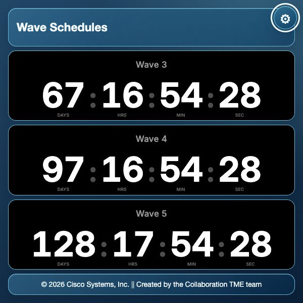

This example uses the external [H2R Graphics Countdown Timer](https://h2r.graphics/tools/countdown/), which H2R presents as a free streaming tool with shareable URLs. The settings form can build the H2R URL for each block from a target date and time, title, completion message, and H2R color theme. H2R Graphics is developed by Barker Technologies AB; its availability, behavior, and terms remain outside this project.

#### Live weather from coordinates

[Open the live-weather example](https://ctg-tme.github.io/Simple-WebWidget/#theme=ArcticNight&heading=Local%20Conditions&weather=true&latitude=40.7128&longitude=-74.0060&temperatureUnit=fahrenheit&time=true&timeZone=America%2FNew_York&info1=Live%20weather%20for%20the%20configured%20location&xLaunch=SWW_Example)

```text
https://ctg-tme.github.io/Simple-WebWidget/#theme=ArcticNight&heading=Local%20Conditions&weather=true&latitude=40.7128&longitude=-74.0060&temperatureUnit=fahrenheit&time=true&timeZone=America%2FNew_York&info1=Live%20weather%20for%20the%20configured%20location&xLaunch=SWW_Example
```

### Dynamic RoomOS macro example

The included [Simple WebWidget Dynamic POC macro](examples/roomos/Simple-WebWidget-Dynamic-POC_2026.js) demonstrates how a RoomOS macro can build and save a widget URL from live device values, subscribe to changes, and dynamically add or remove an information block.

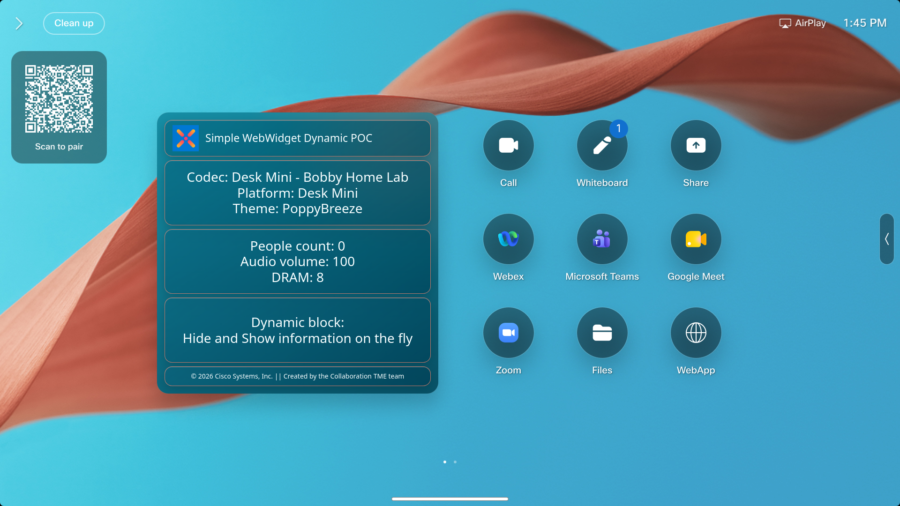

This is an educational example, not a complete or production-ready solution. It intentionally keeps the behavior visible and easy to follow:

- Reads the current RoomOS theme, device name and platform, people count, audio volume, DRAM status, and December-theme setting.
- Rebuilds the widget when subscribed values change and toggles `info3` every five seconds to demonstrate content appearing and disappearing dynamically.
- Adds `xLaunch=SWW_POC_Macro` for cross-launch attribution and hides the settings gear.
- Detects an existing WebWidget and asks before replacing it because RoomOS supports only one WebWidget at a time.

Before using the macro, review its constants, device compatibility, update frequency, error handling, and overwrite behavior. A production integration should update only when needed, avoid unnecessary saves, and be tested against the specific RoomOS software and hardware in scope.

## Hash parameters

Widget configuration is supplied exclusively through URL hash parameters—everything after `#`. URL query parameters are ignored. The settings form is the recommended way to create or edit them, but the supported parameters can also be written manually. Fragments are not included in HTTP requests to the hosting server, but they may remain visible in browser or device history, bookmarks, screenshots, logs captured by client software, and management interfaces. Never place passwords, tokens, personal data, or other secrets in widget fragments.

| Parameter | Content |
| --- | --- |
| `theme` | RoomOS 26 theme name; defaults to `EveningFjord` |
| `heading` | Information heading |
| `weather` | Set to `true` to show weather |
| `latitude` | Latitude used to retrieve current weather; required with `weather=true` |
| `longitude` | Longitude used to retrieve current weather; required with `weather=true` |
| `temperatureUnit` | `fahrenheit` (default) or `celsius` |
| `time` | Set to `true` to show a 24-hour clock |
| `timeZone` | Optional IANA timezone, such as `America/New_York`; otherwise the browser or device timezone is used |
| `info1` | First information block; text or a validated HTTPS URL rendered in an iframe |
| `info2` | Second information block; text or a validated HTTPS URL rendered in an iframe |
| `info3` | Third information block; text or a validated HTTPS URL rendered in an iframe |
| `iconUrl` | Validated square branding image URL displayed borderlessly to the left of the heading |
| `hideSettings` | Set to `true` to hide the settings gear after deployment; remove it manually from the URL to restore the gear |
| `xLaunch` | Optional one-time cross-project app name; captured in analytics during initial load, removed from the visible URL, and intentionally absent from the settings drawer |

These are the only supported hash parameters. Legacy names, unknown parameters, duplicate parameters, and boolean values other than `true` or `false` reject the complete configuration. The settings form omits disabled boolean options rather than writing `false`.

When `weather=true` and coordinates are configured, the widget retrieves current temperature, weather condition, and day/night state directly from Open-Meteo. It refreshes every 15 minutes and converts the current WMO weather code into a recognizable clear, cloudy, fog, rain, snow, or thunderstorm symbol. Neither the temperature nor the weather symbol can be overridden by hash parameters. The weather symbol links to the data provider for attribution. This live feature requires outbound HTTPS access to `api.open-meteo.com` from the RoomOS device.

### Input limits and invalid configuration

The widget validates the complete fragment before displaying supplied content or requesting a branding image. These limits are intentionally sized for the 600 × 600 layout:

| Input | Maximum characters |
| --- | ---: |
| Complete fragment, before decoding and excluding `#` | 8,192 |
| `heading` | 80 |
| `timeZone` | 64 |
| Each of `info1`, `info2`, and `info3` | 400 |
| `iconUrl` | 2,048 |
| `theme` | 32 |
| Each coordinate | 24 |
| `temperatureUnit` | 16 |
| `xLaunch` | 64 |
| Boolean fields | 5 |

Malformed percent encoding, incomplete or invalid coordinates, an excessive fragment, an oversized field, an unsupported or duplicate parameter, an invalid boolean, or an unsafe branding or iframe URL causes the complete configuration to be rejected. Existing remote sources are removed and the widget displays **Widget configuration is invalid**. The settings gear remains available so the configuration can be replaced. Values are never truncated silently.

### Branding image policy

Branding images may use any cross-origin HTTPS URL, a same-origin HTTPS URL, or a relative URL hosted with the widget. During local development, same-origin HTTP images are also allowed from `localhost` or the private LAN address serving the widget.

URLs with credentials, unsupported schemes such as `javascript:`, `file:`, or `data:`, malformed URLs, and loopback or private literal targets are rejected. Private or loopback same-origin HTTP is allowed only in local development. Validation deliberately does not attempt DNS-based private-network detection, so administrators should use trusted image hosts where possible. Branding image requests use a `no-referrer` policy.

### Iframe content

When the complete value of `info1`, `info2`, or `info3` is a validated HTTPS URL, the block renders that URL in a sandboxed iframe. Relative same-origin URLs are also supported. Same-origin HTTP is permitted only during local development. Ordinary text, including multiline text, continues to render as escaped text.

Iframe navigation does not use the same CORS permission model as `fetch`. Cross-origin frames receive `allow-same-origin` so their dynamic modules, cookies, and local storage can work while the browser's origin boundary continues to isolate them from the widget. Same-origin frames retain the stricter opaque-origin sandbox because combining same-origin access with scripts would let same-origin content escape the sandbox.

A destination can refuse embedding with `X-Frame-Options` or a Content Security Policy `frame-ancestors` directive. Browsers do not reliably expose those refusal details to the parent page, so the widget cannot guarantee automatic detection or safely use a fixed load timeout. Failures delivered through the iframe error event are logged as `information-frame-load-failed` and the affected block is hidden. The browser may report other embedding refusals directly in its console. Confirm that each destination explicitly permits iframe embedding before deployment.

### Line breaks

Information blocks support line breaks in any of these forms:

- URL-encoded newline: `%0A`
- Literal escaped newline: `\n`
- HTML-style break text: `<br>` or `<br/>`

The text remains escaped; other HTML is never rendered. Encode the full value of `iconUrl`, especially when the image URL contains its own `?` or `&` characters.

### Console diagnostics

Invalid configuration, invalid time-zone fallback, weather retrieval failure, branding image load failure, and detectable iframe load failure are reported in the browser console with a `[Simple-WebWidget]` prefix and a stable issue code. Configuration values and the complete fragment are not logged. For example, a rejected scheme reports `icon-url-unsupported-scheme`, while a failed image request reports `branding-image-load-failed`.

## Analytics and privacy

The production GitHub Pages build uses two Aptabase events. They are emitted only during a full page load, not for live settings previews or hash changes:

- `page_opened` is emitted once so it remains an accurate page-load count. It has no properties unless a valid `xLaunch` value is present.
- `parameter_used` is emitted once for each recognized parameter in the fragment. Its `parameter_name` property is the parameter name, such as `heading`, `info1`, or `hideSettings`.

To see all parameter totals together in Aptabase, select the `parameter_used` event, choose `parameter_name` as the property, and use the **Events** metric. Every recognized parameter then appears as a row in one breakdown instead of appearing as a separate `true` property. This model generates one analytics event per recognized parameter in addition to the single `page_opened` event.

`xLaunch` is the only hash parameter whose value is captured. Its presence is counted with the other parameters under `parameter_used`, while its value is sent only on the `page_opened` event under the `xLaunch` property. It is intended for apps that cross-launch into Simple WebWidget and should contain only the launching app's non-sensitive name. Set it only when you are willing to share that app name with the Simple WebWidget developer. The value is read once and then removed from the visible URL to reduce accidental copying.

All other hash parameter values, the complete fragment, headings, information text, iframe or image URLs, coordinates, time zones, and themes are never included in the custom analytics events. Unknown parameter names are also excluded. The Aptabase Web SDK adds its standard event timestamp, generated session identifier, locale, debug state, and SDK metadata and sends requests without browser credentials.

The Aptabase client App Key is supplied to GitHub Actions as the repository secret `APTABASE_API_KEY`. The workflow exposes it only to the Vite build step; dependency installation, tests, and deployment do not receive it. Add the key under **Repository settings → Secrets and variables → Actions → New repository secret** before pushing the analytics-enabled build.

Because this is a front-end-only application, the client App Key becomes visible in the compiled JavaScript and browser request after deployment even though it is absent from Git history. Use only an Aptabase client App Key here—never a privileged credential or personal token.

Local development leaves analytics disabled by default. To test it locally, copy `.env.example` to `.env.local`, add a development Aptabase App Key, and restart Vite. Local environment files are ignored by Git.

## RoomOS 26 Themes

The `theme` parameter accepts the endpoint values exactly as written. Every image below is a compact screenshot captured from the running WebWidget with generic content.

<table>
  <tr>
    <td align="center">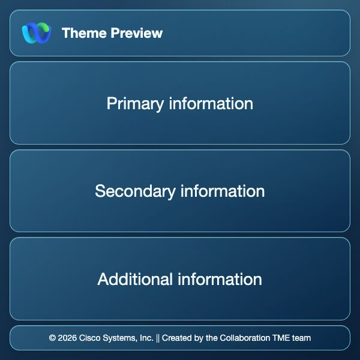<br><code>ArcticNight</code></td>
    <td align="center">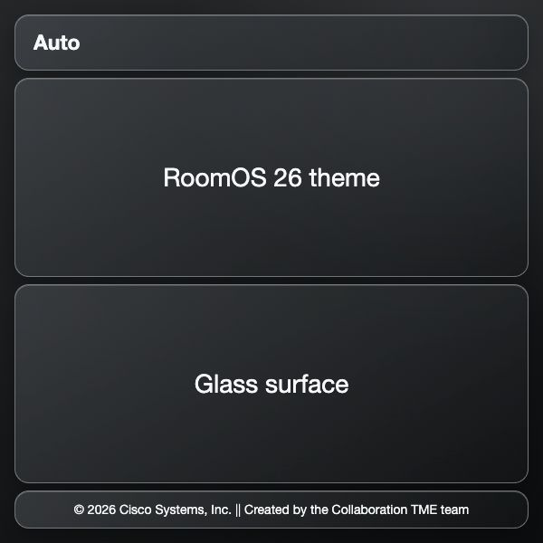<br><code>Auto</code><br><sub>Follows device appearance</sub></td>
    <td align="center">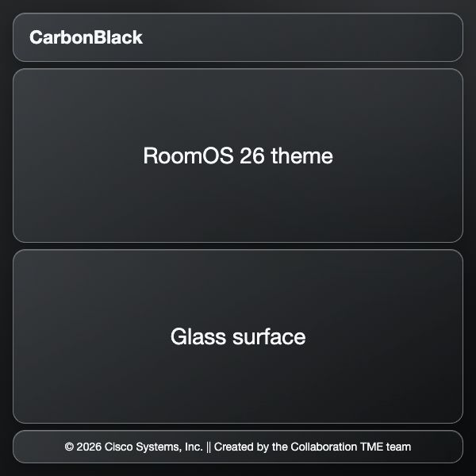<br><code>CarbonBlack</code></td>
  </tr>
  <tr>
    <td align="center">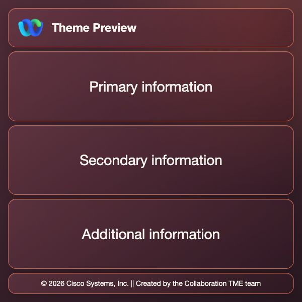<br><code>ChiliPlum</code></td>
    <td align="center">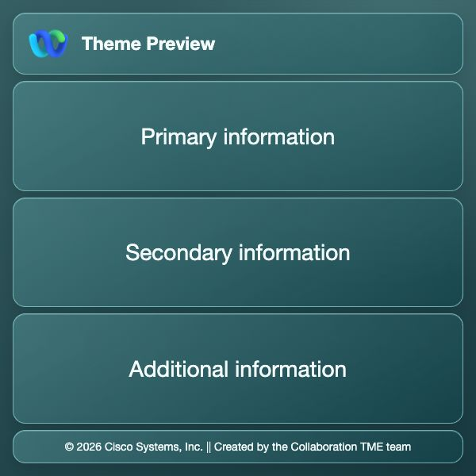<br><code>CrystalMist</code></td>
    <td align="center">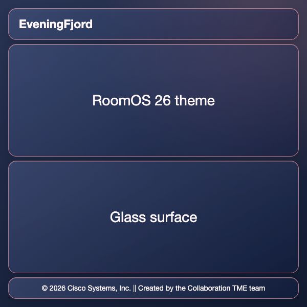<br><code>EveningFjord</code><br><sub>Default</sub></td>
  </tr>
  <tr>
    <td align="center">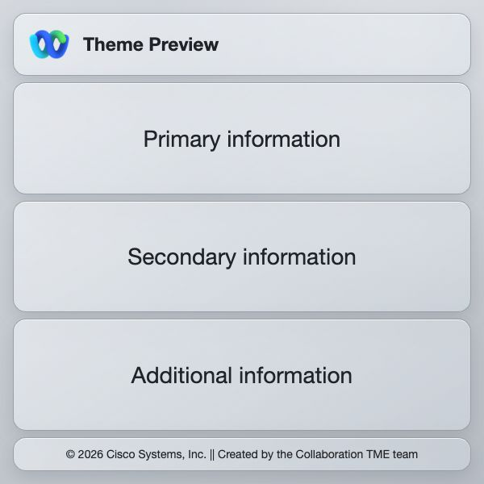<br><code>FirstLight</code></td>
    <td align="center">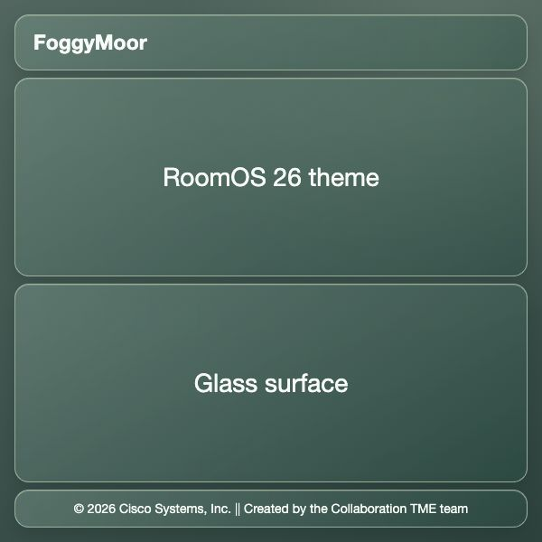<br><code>FoggyMoor</code></td>
    <td align="center">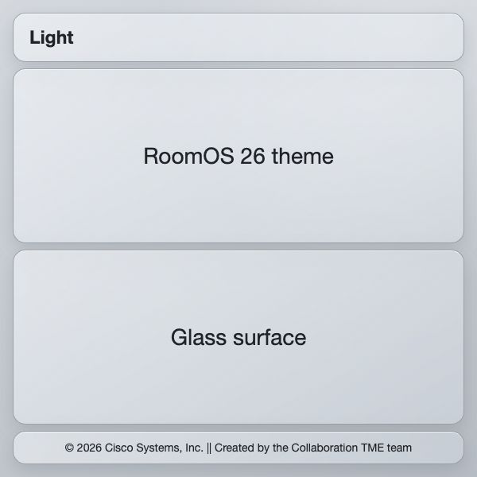<br><code>Light</code></td>
  </tr>
  <tr>
    <td align="center">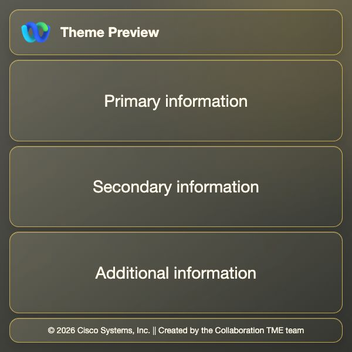<br><code>MeadowStone</code></td>
    <td align="center">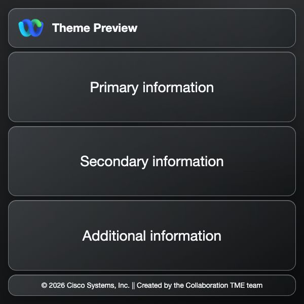<br><code>Night</code></td>
    <td align="center">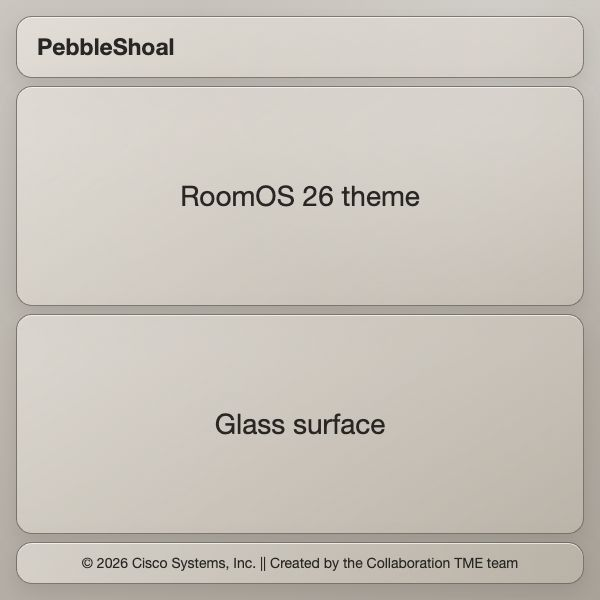<br><code>PebbleShoal</code></td>
  </tr>
  <tr>
    <td align="center">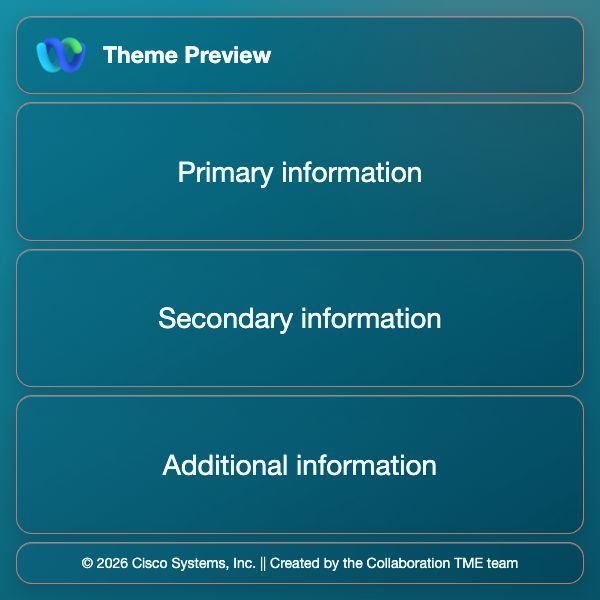<br><code>PoppyBreeze</code></td>
    <td align="center">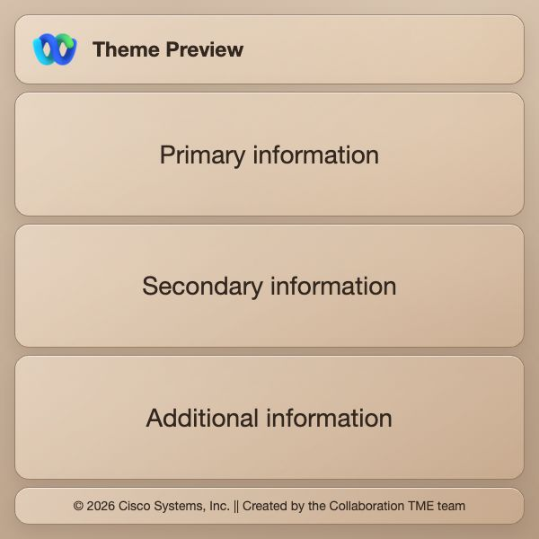<br><code>SandShoal</code></td>
    <td align="center">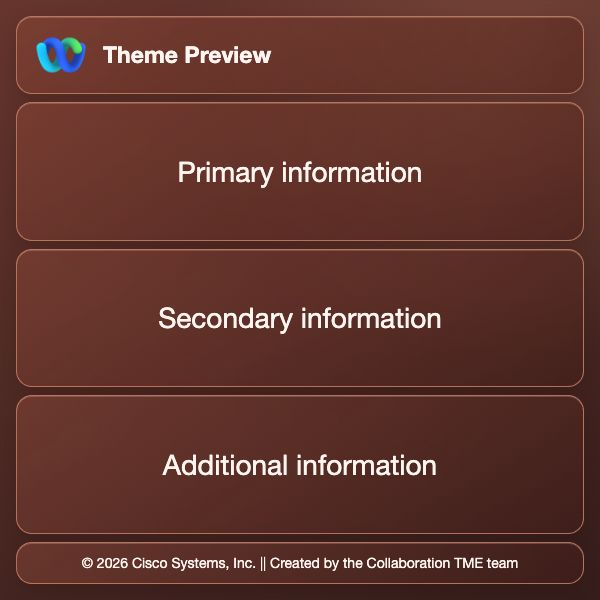<br><code>SmokedRose</code></td>
  </tr>
</table>

Missing or unrecognized values use `EveningFjord`. `Light` uses the `FirstLight` palette, `Night` uses the `CarbonBlack` palette, and `Auto` follows the browser or device light/dark appearance.

Each palette covers the complete page body, including the space around and between content sections. Content sections use translucent glass backgrounds with blur and a leaf-derived outline color selected to complement the corresponding RoomOS wallpaper while preserving readable contrast.

## Local development

Install [Git](https://git-scm.com/) and [Node.js 22](https://nodejs.org/) first, then clone and start the project:

```sh
git clone https://github.com/ctg-tme/Simple-WebWidget.git
cd Simple-WebWidget
npm ci
npm run dev
```

Open the local URL printed by Vite. The development server listens on all network interfaces so RoomOS devices on the same LAN can reach it. Run the development server only on a trusted network or protect access with suitable host firewall controls.

## Production build

```sh
npm ci
npm test
npm run build
npm run check:production-security
```

The static output is written to `dist/`. Production builds include a restrictive Content Security Policy and an explicit `no-referrer` policy. The CSP permits same-origin scripts, styles, and fonts; same-origin, data, and HTTPS images; validated same-origin or HTTPS frames; and outbound connections only to the Open-Meteo weather API and Aptabase's US and EU event endpoints. Development builds omit the CSP meta tag so Vite hot-module replacement continues to work.

Pushes to `main` run the included GitHub Pages deployment workflow. In the repository settings, set **Pages → Build and deployment → Source** to **GitHub Actions**. Deploying directly from the `main` branch serves the unbuilt Vite source and will not render the widget correctly.

After a successful workflow run, the widget is available at [https://ctg-tme.github.io/Simple-WebWidget/](https://ctg-tme.github.io/Simple-WebWidget/).

## License

This project is licensed under the [Cisco Sample Code License, Version 1.1](LICENSE).
